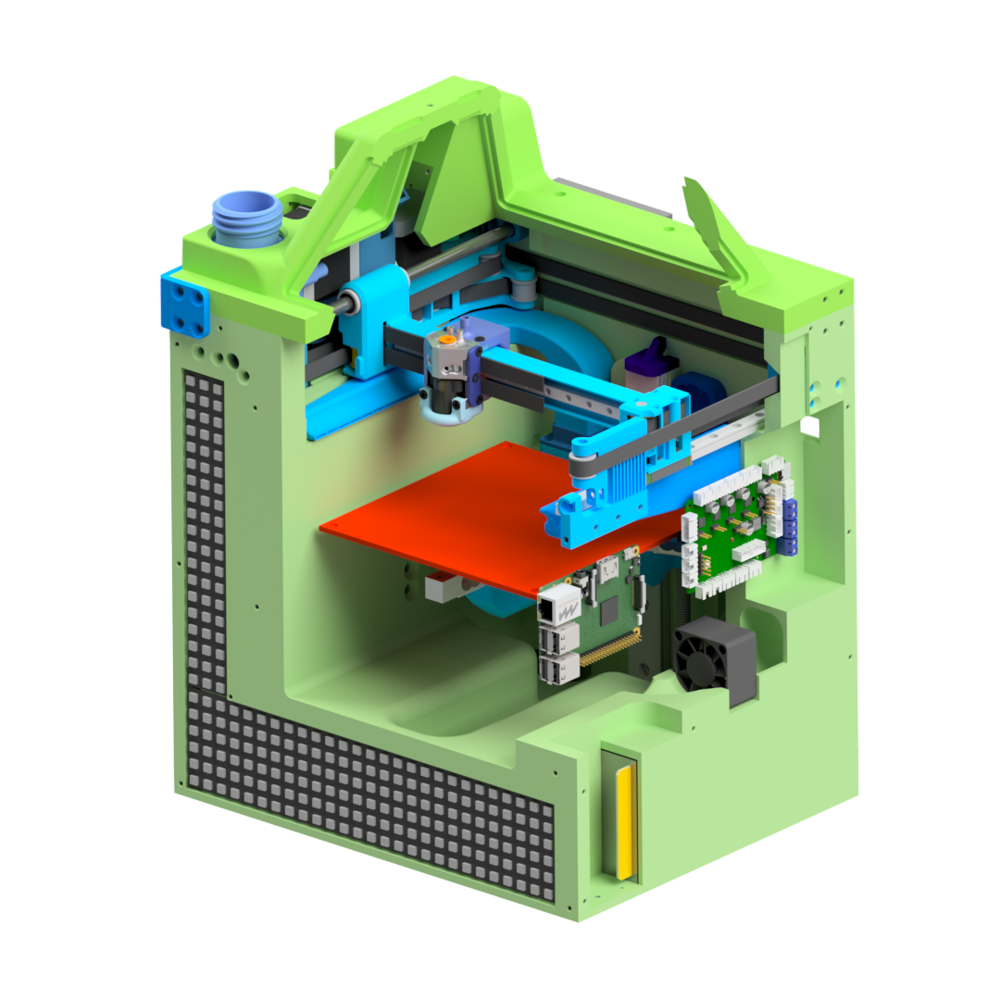

# Halon 3D-Printer
## What is Halon
Halon is my 3D-Printer design. Its an small self containt portable high speed FDM 3D-Printer.
I designed this priter to be my travel printer for events and as an rabbit prototyping printer.

## Design Targets
1. The Printer should be usable as an praktical 3D-Printer
2. The Printer should be Self Containt. No external spool, no external power supply and an compleate printer enclosure.
3. The Printer should be as fast as possible. An design goal of 1m/s velocity and 100m/s² has been set.
4. The Printer should be buildable with standard mashiens avavible in moast Hackspaces/Makerspaces.

# Prototype 0
This Project started in autum 2023 as an studing project. I have developed the prototype over an halve jear and i build the prototype. On the GPN22 i presented the prototype. Because of the interest and feedback on the event, i decided to publish the design of printer so more people can build this design. 

https://github.com/user-attachments/assets/4c1e7ec1-202b-4d33-9429-380821325e8d

The mechanics of the prototype function as Planned. It reaches an maximum speed of 0.5m/s with an acceleration of 100m/s² reliable without stepp loss. Even at this high acceleration the ringing on the axis is minimal. 
The print cooling system is sufficient even on maximum print speed. But, the prototype uses two 15mm turbines for the side cooling and an compressor for the head part cooling. Both are extremly loud (operator needs ear protection when opening the enclosure) which violates the first design target.
The extrusion system is currently the speed limiting factor on this mashien. The prototype uses an Creality K1 Hotend and an dual gear browden extruder. Its currently limited to 30mm³/s. The hotend and the XY motors get cooled by an water cooling loop.

The Prototype was first designed to be mostly printed on the university SLS Printer. So some Parts arent optimised for more Accesseble Printing methodes. The hotend heatsink designed to be manufactured from aluminium with an SLM Printer.

## Technical specifications
- Maximum speed 500mm/s at 100m/s² acceleration
- Print area 150x150x120mm
- Machine size 297x240x430mm
- Encapsulated print area
- Water cooled print head
- Acceleration sensor for input shaper
- Fillament spool integrated in printer
- Integrated active fillament drying box (maximum 70°C with fan)
- Charcoal filter with fan
- Auto-levelling via load cells under the print bed
- Rigid print bed
- Strong side cooling
- Rigid axle design for low ringing
- Klipper firmware
- Clog-free Y-axis guide

## Electronics
Two Bigtreetech skr pico control boards, two Raspberrypi picos and a Raspberrypi 4 were used to control the prototype. Two Bigtreetech TMC5160T Plus driver boards with a supply voltage of 48V were used for the stepper motors. A used server power supply was used as the power supply, providing 12V with a maximum output of 450W. Two boost converters are used to generate a 24V and a 48V rail from the 12V power supply. The first skr Pico control board is powered by the 24V and drives the stepper motors for the E and Z axes. It also drives the hot end heaters and some of the fans. The second SKR Pico control board is supplied with 12V. This board controls the heating bed and the drying box heating. The 48V stepper motor drivers are controlled by the first Rasperrypi Pico. The second pico is not connected to the Klipper. It reads the load cells under the bed and simulates a BL-Touch for automatic bed levelling to the controller.

## What works well
The printer's motion system works as designed. The printer achieves a positioning speed of 0.5m/s with an acceleration of 100m/s². The rigid axis structure means that even at these extreme settings, ringing is very low.
The cantilevered Z-axis is very rigid due to the rigid guide and wide beam.
Automatic levelling via load cells under the print bed is reliable and accurate.
The printer setup with a large print enclosure works.

https://github.com/user-attachments/assets/8164ebac-18e3-453c-8e3b-d6f8cc71612e

## What is still bad
A few problems were discovered with the first prototype. Firstly, water cooling will not be installed in future versions. The improved printhead cooling provided by water cooling does not justify the significantly increased maintenance and space requirements of water cooling. On the one hand, the cooling water has to be refilled every few days if silicone hoses are used. On the other hand, the tightness of the system is a problem. My prototype is currently leaking because the water tank has cracked due to the high pressure chamber temperatures.
Secondly, the extrusion system of the current printer is still suboptimal. In the prototype, the filament tube is bent too tightly in some places, causing high friction in the filament tube. In addition, the extruder cuts through the fillament when overloaded, which still happens too often due to the high friction in the system. 
The hot end is the limiting factor for print speed in the prototype.
When I designed the electronics, I didn't know about the Bigtreetech Kraken board. This would have simplified the electronics considerably. 
The side cooling fans can effectively cool the print even at maximum speed. However, the fans are so loud at maximum speed that ear protection is required next to the machine. The same applies to the compressed air cooling of the parts. This uses a piston compressor. However, this has a very high pressure pulsation, which also makes it very loud.
In addition, the heat generated by the stepper motors and voltage converters was underestimated during the design phase, which meant that fans had to be added to the prototypes at a later stage.

# Version 1
In the second version of the Halon printer I would like to fix the bugs of the first version. The following optimizations are planned:
- Replacing the water cooling of the print head with compressed air cooling (less maintenance)
- Upgrading the print head to a Mellow Goliath (higher volume flow)
- Modification of the extruder design (higher reliability, i have an high grip three wheel extuder design in the works)
- Use of a CPap fan for part cooling (noise reduction)
- Use of large radial fans for additional cooling (noise reduction)
- Modification of the control board to a Bigtreetech kraken
- Optimization of the housing design (improved assembly)
